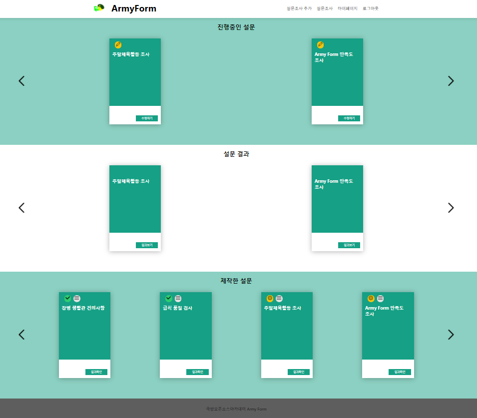

Army Form
===


<p align="center">
    
    <br/>
    
    <a href="https://opensource.org/licenses/MIT"></a>
    <a href="https://github.com/osamhack2021/Web_ArmyForm_LFDF/actions"></a>
</p>

## :scroll: 프로젝트 소개
#### Army Form은 보다 편리한 설문조사를 통해 평소 부대에 건의하고 싶었던 사항을 전달할 수 있는 어플리케이션입니다.
#### 또한, 설문조사를 통해 용사들의 건의 사항을 개선함으로써 용사들이 직접 부대를 만들어 나간다는 의미를 담고 있습니다.
#### 최근 이슈가 되었던 군급식을 선두로 하여 용사들의 건의 사항을 종합하여, 이를 각 부대 지휘관에게 효율적으로 전달합니다.
#### 군 부대에서 사용하기 적합하고 광범위한 용도로 사용될 수 있는 설문조사 프로그램입니다.

## :bulb: 기대 효과
#### 1️⃣ 설문 조사를 통해 수집된 데이터를 이용하여 빅데이터를 형성해 추후 타 부대 개선에 도움을 줄 수 있습니다.
#### 2️⃣ 종이를 출력하여 사용하지 않기 때문에 더 나은 환경을 만드는데 이바지 할 수 있습니다.
#### 3️⃣ 매번 설문 조사를 할 때마다 부대 인원만큼의 설문지를 출력해야하는 행정 소요를 줄일 수 있습니다.
#### 4️⃣ 장소에 제약을 받지 않고 어디서든 설문을 참여할 수 있기 때문에 더 높은 참여도 증진 효과를 얻을 수 있습니다.
#### 5️⃣ 설문지 결과함이 외부에 노출되어 있지 않기 때문에 비밀성 유지에 도움이 됩니다.

## :speech_balloon: 기능 설명
   ### 	:bookmark_tabs: 메인페이지  
   
   
   
   - 진행중인 설문 : 현재 속한 부대에서 진행하고 있는 설문조사를 확인 또는 참여할 수 있습니다.  
   - 설문 결과 : 자신이 참여한 설문조사가 완료되었는지 또는 결과를 볼 수 있습니다.  
     (예 : 화장실에 휴지 비치 요망 -> 조만간 화장지를 비치하겠습니다.)  
   - 제작한 설문 : 자신이 만들었던 설문조사를 확인 또는 수정할 수 있습니다.  
   
   ### :clipboard: 설문조사 생성하기  
   
   
   
   - 다양한 폼(객관식, 주관식, 이미지 등)을 제공하여 쉽게 여러 종류의 설문조사를 생성할 수 있습니다.
   - 익명성을 제공하기 위해서 익명 또는 비익명 설문를 선택할 수 있습니다.
   - 설문조사의 제출 기한을 정할 수 있습니다.


   ### 	:memo: 설문조사 참여하기 
   
   
   
   - 제출 기한 내 답변 제출을 하지 않는다면 언제든지 수정이 가능합니다.
   - 최종적으로 답변 제출을 누르게 되면 설문이 제출됩니다.
   
   ### :bar_chart: 설문조사 결과보기
   
   
   
   - 답변이 필요한 설문조사의 경우 답변을 입력하여 설문조사를 참여한 장병들에게 조치 내용을 알릴 수 있습니다.
     (예시 : 화장실에 화장지를 배치하겠습니다. -> 장병들이 어떠한 조치를 하겠다는 내용을 확인할 수 있습니다.)
   - 각 질문 형태에 알맞는 결과를 보여줍니다.
     (예시 : 선택형 질문 -> 막대 그래프 / 주관식 질문 -> 워드클라우드 또는 각 질문에 대한 퍼센트치)
   - 전체적인 내용을 한 번에 확인할 수 있습니다.

## 	:computer: 컴퓨터 구성 / 필수 조건 안내 (Prerequisites)
 - Node.js (v14.17.6)을 지원하는 운영 체제 [Node.js 다운로드](https://nodejs.org/download/release/v12.22.6/)
 - ES6 이상 지원하는 브라우저

## :hammer_and_wrench: 기술 스택 (Technique Used) 

### Server(back-end)
Node.js | Express.js | PostgreSQL | Sequelize
:------: | :------: | :------: | :------: 
<a href="https://nodejs.org/ko/"></a> | <a href="https://expressjs.com/ko/"></a> | <a href="https://www.postgresql.org/"></a> | <a href="https://sequelize.org/"></a>
14.17.6 | ^4.17.1 | 9.5.25 | ^4.28.10

<!-- https://github.com/ikatyang/emoji-cheat-sheet/blob/master/README.md -->

### Front-end
React.js | Survey.js
:------: | :------:
<a href="https://ko.reactjs.org/"></a> | <a href="https://surveyjs.io/"></a>
^17.0.24 | v1.8.66

## 	:floppy_disk: 설치 안내 (Installation Process)
- 기본적으로 Node.js 의 설치가 필요합니다.
    ```bash
        $ curl -fsSL https://deb.nodesource.com/setup_12.x | sudo -E bash -
        $ sudo apt install -y nodejs
    ```
- Git을 이용해 저장소를 불러옵니다.
    ```bash
        $ git clone https://github.com/osamhack2021/Web_ArmyForm_LFDF
    ```
- Frontend 빌드
    ```bash
        $ cd frontend
        $ npm run build
    ```
- Backend 빌드
    ```bash
        $ cd backend
        $ npm run build
    ```

## :mag_right: 프로젝트 사용법 (Getting Started)
- Api 서버 실행
    ```bash
        $ cd backend
        $ npm install
        $ npm run build
        $ npm start
    ```
    
- Web 서버 실행
    ```bash
        $ cd frontend
        $ npm install
        $ npm run build
        $ npm start
    ```
 
## :two_men_holding_hands: 팀 정보 (Team Information) :two_men_holding_hands:
이름 | 역할 | Github ID | E-mail
----- | ----- | ----- | -----
민승기 | backend 총괄 | <a href="https://github.com/ironore15"></a> | <a href="mailto:ironore15@gmail.com"></a>
이형창 | frontend 총괄 | <a href="https://github.com/AnOldStory"></a> | <a href="mailto:AnOldStory@gmail.com"></a>
홍태성 | backend api 제작 | <a href="https://github.com/tshong3"></a> | <a href="mailto:tshong1002@gmail.com"></a>
채현우 | react frontend 제작 | <a href="https://github.com/hyunwoo0081"></a> | <a href="mailto:hyunwoo0081@gmail.com"></a>

## :label: 저작권 및 사용권 정보 (Copyleft / End User License)
<p align="center">
    <a href="https://opensource.org/licenses/MIT">
</a>
